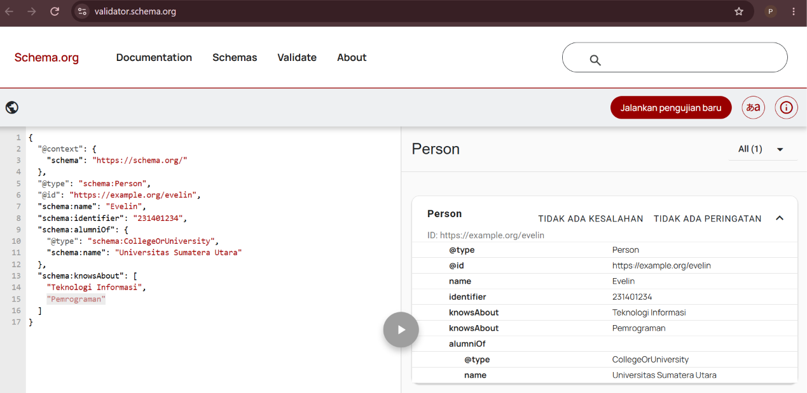
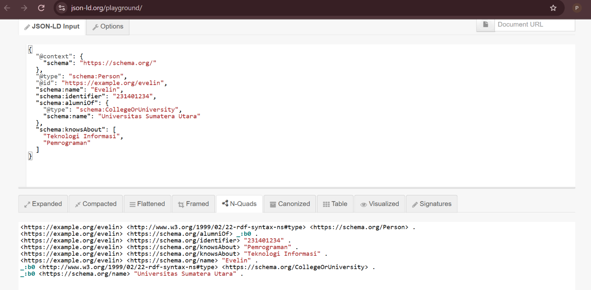
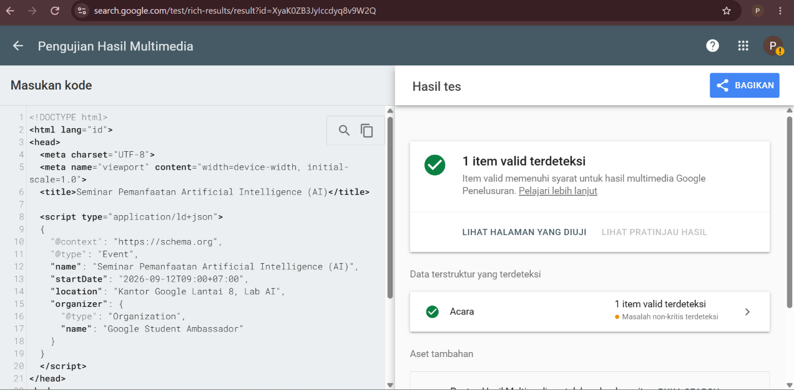

# Latihan Pertemuan 3 - JSON-LD dan Structured Data

## Identitas
- Nama: ISI_NAMA
- NIM: ISI_NIM

## Struktur Hasil
- `profil_saya.jsonld`
- `profil_perbaikan.jsonld`
- `seminar.html`
- folder `screenshots`

## 1. JSON Biasa dan JSON-LD
1. Perbedaan fungsi kunci: 

   Pada kunci `nama/pekerjaan` pada JSON biasa yaitu hanya atribut lokal untuk membuat struktur data yang hanya dipahami oleh pembuat skema. Sedangkan `nama/jobtitle` pada JOSN-LD, karena sudah terstandarisasi kosakata global dari schema.org dan langsung dipetakan ke IRI global, jadi datanya tidak hanya sekedar terstruktur secara sintaks melainkan bisa dipahami oleh mesin yang memiliki makna universal.
2. Fungsi `@context`, `@type`, dan `@id`:
   
   - `@context` : menentukan konteks yang digunakan yang memberitahukan mesin arti kosakata pada JSON-LD
   - `@type` : menentukan jenis entitas yang dideskripsikan yang penulisannya *case-sensitive* dan memberitahu mesin jenis objek dan entitasnya.
   - `@id` : memberikan identitas unik kepada entitas atau IRI dari node dimana ini digunakan untuk memberikan URI pada entitas.
3. Node tanpa `@id`: 

   Node akan berstatus sebagai *blank node* yang membuat node tidak memiliki identitas dan tidak bisa dirujuk oleh entitas.

## 2. Pemeriksaan schema.org
1. Alasan memilih tipe paling spesifik: 

   Supaya data dibuat lebih jelas dan maknanya tepat untuk mesin pencarian. Jika hanya menggunakan tipe yang terlalu general seperti `thing`, mesin akan susah menentukan konteks datanya. Misalnya untuk mahasiswa menggunakan person dan untuk univ menggunakan CollegeOrUniversity. 
2. Nama properti dan bahasa nilai: 

   Karena nama propertinya sudah ditentukan dalam kosakata *schema.org* jadi harus mengikuti kosakatanya agar mesin pencariannya tidak bingung. Sedangkan nilainya itu hanya informasi dan data yang ingin kita sampaikan (bebas menggunakan bahasa apa).
3. Manfaat array pada `knowsAbout`: 

   Array pada `knowAbout` berfungsi untuk menyimpan data yang lebih dari satu nilai di dalamnya. Karena kita dapat memasukkan lebih dari satu keahlian yang kita miliki didalamnya misalnya `["Web Semantik", "Java", "C++"]` tanpa menulisnya berulang2.

## 3. Perbaikan Lima Kesalahan
| No. | Bagian Salah | Alasan | Perbaikan |
|---|---|---|---|
| 1 | "@type": "person" | Penulisan tipe yang ditentukan oleh Schema.org harus diawali huruf kapital | "@type": "Person" |
| 2 | 'name': "Rina Anggraini" | Tanda kutip satu ditandai tidak valid sebagai JSON | "name": "Rina Anggraini" |
| 3 | "birthDate": "12 September 2004" | Format tanggal yang sah adalah dengan sistem penanggalan Gregorian | "birthDate": "2004-09-12" |
| 4 | "nomorInduk": "221401001" | Properti tersebut bukan properti standar di Schema.org untuk penyimpanan identitas seseorang | "identifier": "221401001" |
| 5 | "nomorInduk": "221401001", | Properti terakhir tidak boleh diikuti tanda koma | "nomorInduk": "221401001" |

## 4. Triple dari JSON-LD Playground
Tuliskan satu baris N-Quads yang terbentuk:

```text
<https://example.org/evelin> <https://schema.org/name> "Evelin" .
```

## 5. Hasil Validasi
- Schema Markup Validator: 
   Data terstruktur berhasil dikenali sebagai Person, dan properti yang digunakan valid serta tidak terdapat kesalahan atau peringatan.
   
- Rich Results Test: 
   1 item valid terdeteksi sebagai Acara (Event), dengan 8 masalah non-kritis berupa properti opsional yang tidak tersedia.

   Peringatan yang muncul:

   - Kolom eventStatus tidak ada (opsional)
   - Kolom description tidak ada (opsional)
   - Kolom endDate tidak ada (opsional)
   - Kolom offers tidak ada (opsional)
   - Kolom performer tidak ada (opsional)
   - Kolom image tidak ada (opsional)
   - Kolom address tidak ada (opsional)
   - Kolom url tidak ada (opsional)

- JSON-LD Playground: 
   JSON-LD berhasil dikonversi menjadi N-Quads dan menghasilkan triple yang sesuai dengan data yang dimasukkan.

## 6. Refleksi
1. Mengapa `@context` disebut jembatan menuju makna?

   @context disebut jembatan menuju makna karena menghubungkan istilah yang digunakan dalam JSON-LD dengan kosakata yang memiliki arti tertentu. Misalnya, schema:name menunjukkan bahwa data tersebut merupakan nama berdasarkan Schema.org.
2. Apa perbedaan fungsi Schema Markup Validator dan Rich Results Test?

   Schema Markup Validator digunakan untuk memeriksa apakah structured data menggunakan tipe dan properti Schema.org dengan benar. Sedangkan Rich Results Test digunakan untuk melihat apakah structured data tersebut memenuhi syarat dan dapat digunakan untuk hasil kaya di Google.
3. Mengapa isi JSON-LD harus sama dengan konten yang terlihat pada halaman?

   Karena JSON-LD berfungsi memberikan informasi terstruktur tentang isi halaman. Jika datanya berbeda dengan konten yang terlihat, informasi tersebut dapat dianggap tidak sesuai atau menyesatkan. Jadi, data terstruktur harus menggambarkan informasi yang benar-benar ada di halaman.

## Bukti



